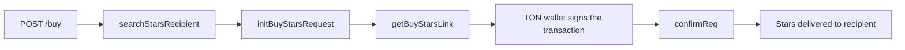

# telegram-stars-gateway

An Express/TypeScript service for buying Telegram Stars with TON through
the unofficial (reverse-engineered) API of [Fragment.com](https://fragment.com/stars/buy).

Fragment has no public official API — this service replays the same
requests its own frontend makes in the browser, authenticating with a
logged-in user's session cookies and signing the TON transaction locally
with a stored wallet.

> ⚠️ This is not an official Telegram/Fragment API. Behavior and
> availability may change without notice, and the session cookies used
> here have a limited lifetime. A step-by-step breakdown of each endpoint
> is in [`docs/`](./docs).

## How it works



## Stack

- **Express 5** + **TypeScript** — HTTP layer (`src/app.ts`, `src/stars/`)
- **Zod** — request validation (`src/stars/stars.schemas.ts`)
- **express-rate-limit** — throttling on `/buy`
- **@ton/ton, @ton/core, @ton/crypto** — signing and broadcasting TON
  transactions (`src/ton/wallet.ts`)
- **dotenv** — configuration via `.env`

## Project structure

```
express/
├── src/
│   ├── app.ts                    # entry point, Express app, auth & error handling
│   ├── middleware/
│   │   ├── apiKey.ts             # x-api-key auth guard
│   │   └── rateLimiter.ts        # rate limit for /buy
│   ├── stars/
│   │   ├── stars.routes.ts       # POST /buy
│   │   ├── stars.controllers.ts  # request handling
│   │   ├── stars.schemas.ts      # Zod input validation
│   │   └── stars.services.ts     # calls to Fragment's private API
│   └── ton/
│       └── wallet.ts             # TON transaction signing & broadcasting
├── package.json
└── tsconfig.json
docs/                              # step-by-step breakdown of Fragment's API
```

## Getting started

```bash
cd express
npm install
```

`.env.example` already lists every variable the app needs, so you don't have to hunt through the source code to find them.

## Running

```bash
npm run dev     # development, tsx watch
npm run build   # compile to dist/ (tsc + tsc-alias resolves @/ imports)
npm start       # run the compiled build (node dist/app.js)
```

### `POST /buy`

Rate limited to 5 requests per minute per client.

```json
{
  "recipient": "@username",
  "qty": 50
}
```

Runs the full purchase flow and returns Fragment's confirmation result
(`{ "ok": true }` on success).
