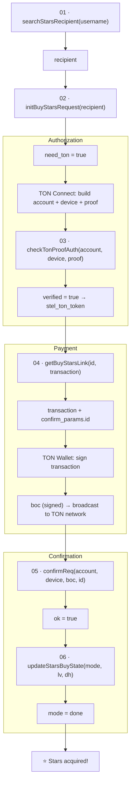

# Flow — Buy Telegram Stars via TON

## Step reference

| # | Method | Input (from) | Output (to) |
|---|--------|---------------|--------------|
| 01 | `searchStarsRecipient` | `username` | `recipient` → 02 |
| 02 | `initBuyStarsRequest` | `recipient` (01) | `need_ton=true` |
| 03 | `checkTonProofAuth` | TON Connect `account/device/proof` | `stel_ton_token` |
| 04 | `getBuyStarsLink` | `id` (from wallet session) | `transaction`, `confirm_params.id` → 05 |
| 05 | `confirmReq` | `boc` (signed tx), `id` (04) | `ok=true` |
| 06 | `updateStarsBuyState` | `mode`, `lv`, `dh` | `ok=true` |